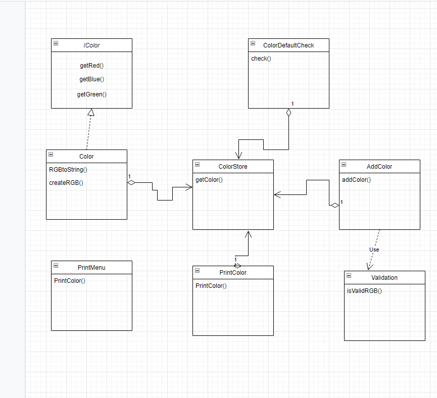

# AdvanceAssignment4

Explain :
/*\  Class for adding color cannot add a color that already exist and cannot add color out of range value using Validation Function.
/*\  Class for Search  ,to return the given value is Default color or not (RGB color). "ColorDEfaultCheck"
/*\  Singleton for ColorStore to provide a global access point to get the instance of the class. "Default colors, one object is needed to coordinate actions across a system."

